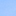
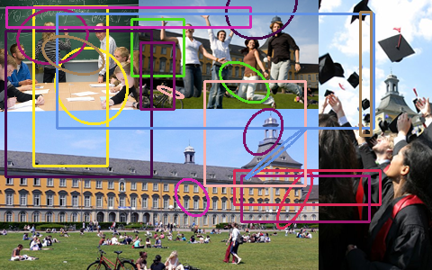

## Output

Input Image                |  Gray Image              
:-------------------------:|:-------------------------:
  |   | 

Subtracted Image                              | Pixel WiseSubtracted Image
:--------------------------------------------:| :------------------------------:
| 

Patch                                         | After Random copying
:--------------------------------------------:| :------------------------------:
   | 

Random Rectangle and Elipse
:--------------------------------------------:
