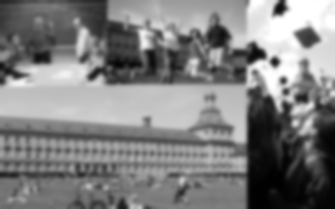
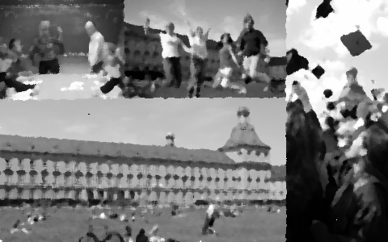
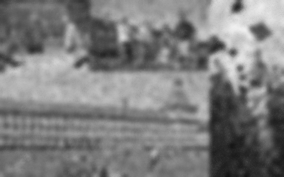
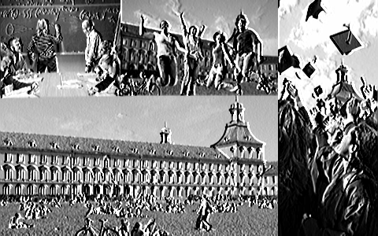
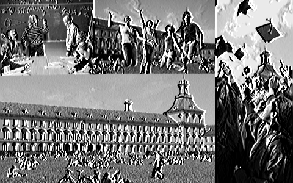

## Output

Original Image                           
:-------------------------:

Opencv Histogram Equalization                 | Custom Histogram Equalization
:--------------------------------------------:| :------------------------------:
| 

Gaussian Blur                                  | Filter2D						| sepFilter2D
:--------------------------------------------:| :--------------------------------------------------:|:------------------------------:
   |  |

Salt and Pepper Noise                 | Gaussian on Salt and pepper
:--------------------------------------------:| :------------------------------:
| 

Median on Salt and pepper                 | Bilateral on Salt and pepper
:--------------------------------------------:| :------------------------------:
| 

filter2D kernel 1                 | sepfilter2D on kernel1
:--------------------------------------------:| :------------------------------:
| 

filter2D kernel 2                 | sepfilter2D on kernel2
:--------------------------------------------:| :------------------------------:
| 
